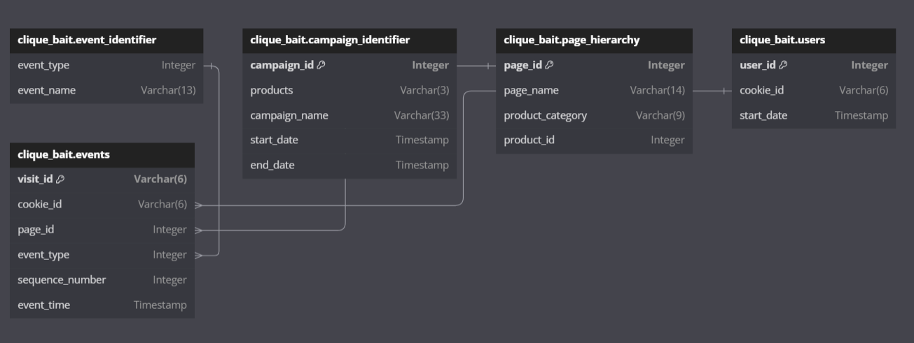

## Case Study Questions - Entity Relationship Diagram


Using the following DDL schema details to create an ERD for all the Clique Bait datasets.

[Click here](https://dbdiagram.io/home) to access the DB Diagram tool to create the ERD.

```sql
CREATE TABLE clique_bait.event_identifier (
  "event_type" INTEGER,
  "event_name" VARCHAR(13)
);

CREATE TABLE clique_bait.campaign_identifier (
  "campaign_id" INTEGER,
  "products" VARCHAR(3),
  "campaign_name" VARCHAR(33),
  "start_date" TIMESTAMP,
  "end_date" TIMESTAMP
);

CREATE TABLE clique_bait.page_hierarchy (
  "page_id" INTEGER,
  "page_name" VARCHAR(14),
  "product_category" VARCHAR(9),
  "product_id" INTEGER
);

CREATE TABLE clique_bait.users (
  "user_id" INTEGER,
  "cookie_id" VARCHAR(6),
  "start_date" TIMESTAMP
);

CREATE TABLE clique_bait.events (
  "visit_id" VARCHAR(6),
  "cookie_id" VARCHAR(6),
  "page_id" INTEGER,
  "event_type" INTEGER,
  "sequence_number" INTEGER,
  "event_time" TIMESTAMP
);
```

### Solution: 

LINK : [dbdiagram.io](https://dbdiagram.io/d/ERD-Clique-Bait-6615560f03593b6b619518e9)

Corresponding DBML code : 

```sql
// Define tables
Table clique_bait.event_identifier {
  event_type Integer
  event_name Varchar(13)
}

Table clique_bait.campaign_identifier {
  campaign_id Integer [pk]
  products Varchar(3)
  campaign_name Varchar(33)
  start_date Timestamp
  end_date Timestamp
}

Table clique_bait.page_hierarchy {
  page_id Integer [pk]
  page_name Varchar(14)
  product_category Varchar(9)
  product_id Integer
}

Table clique_bait.users {
  user_id Integer [pk]
  cookie_id Varchar(6)
  start_date Timestamp
}

Table clique_bait.events {
  visit_id Varchar(6) [pk]
  cookie_id Varchar(6)
  page_id Integer
  event_type Integer
  sequence_number Integer
  event_time Timestamp
}

// Define relationships
Ref: clique_bait.events.cookie_id > clique_bait.users.cookie_id

Ref: clique_bait.events.page_id > clique_bait.page_hierarchy.page_id

Ref: clique_bait.events.event_type > clique_bait.event_identifier.event_type

```


ERD diagram : 

